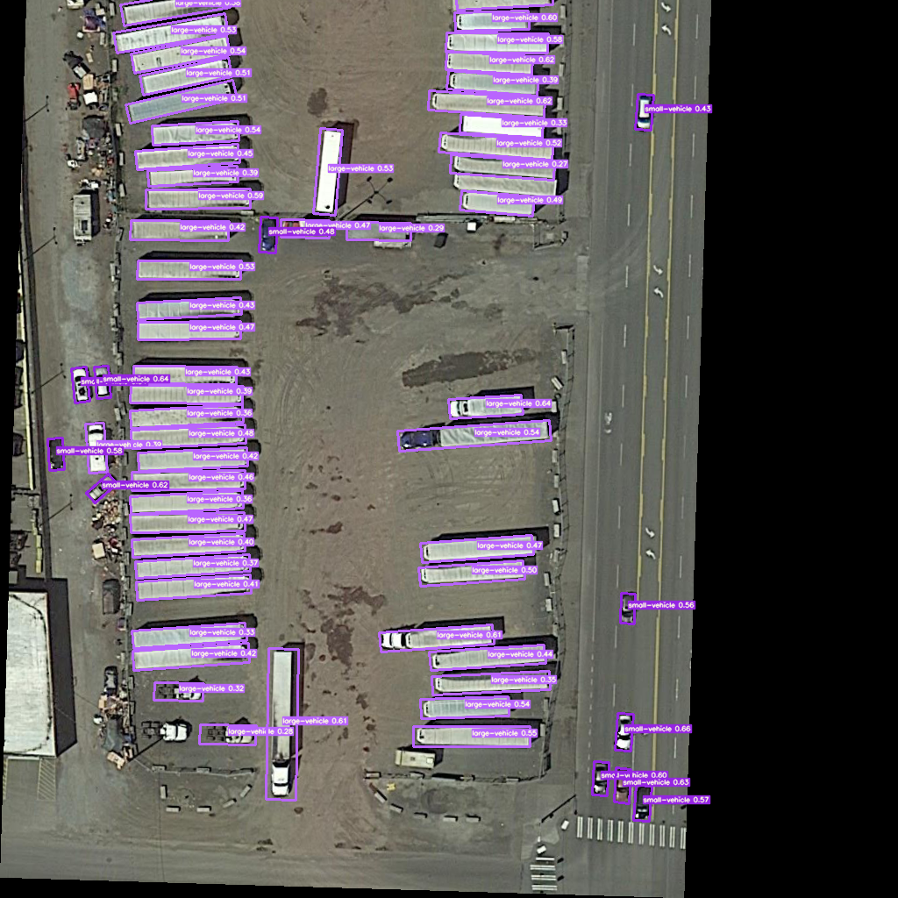

<!--

 * @Description: Oriented Object Detection
 * @Author: zhangbo
 * @Date: 2021-10-19 17:24:35
 * @LastEditTime: 2021-10-19 17:24:35
 * @LastEditors: zhangbo
 * @GitHub:github.com/nanmi
   -->

# Oriented Object Detection base on Yolov5 :fire::heavy_check_mark: 



This project base on https://github.com/hukaixuan19970627/YOLOv5_DOTA_OBB


# News
Implementation of rotating frame drawing verification, FPS ~ 100 - 2021-10-18

# System Requirements

cuda 10.0+

TensorRT 7+

OpenCV 4.0+ (if you need)

swig 

```shell
sudo apt-get install swig
```


# Python packages you should need

Cython
coremltools==4.1
matplotlib>=3.2.2
numpy>=1.18.5
opencv-python==4.1.2.30
onnx==1.8.1
pandas==1.2.3
pillow
PyYAML>=5.3
scipy>=1.4.1
tensorboard>=2.2
torch==1.6.0
torchvision==0.7.0
thop==0.0.31-2005241907
tqdm>=4.41.0
Shapely==1.7.1
seaborn==0.11.1
sotabencheval==0.0.38

# Folders
* YOLOv5_DOTA_OBB : for train/test/detection/export onnxmodel, etc. by pytorch
* this repo : inference code with tensorrt C++ API.

# Installation

Make sure you had install dependencies list above

### build polyiou module.

```shell
cd {YOLOv5_DOTA_OBB}/utils/

swig -c++ -python polyiou.i

python setup.py build_ext --inplace
```

### generate weights from your pretrained model.
```bash
# copy gen_wts.py to train_eval/
cp gen_wts.py {YOLOv5_DOTA_OBB}/

cd {YOLOv5_DOTA_OBB}/

python gen_wts.py 
```

then, the file `ood_yolov5s.wts` appears.

### build engine.

use to parse infer postprocess.
```bash
# copy weights file to infer_trt/
cp {YOLOv5_DOTA_OBB}/ood_yolov5s.wts {this repo}/

mkdir build; cd build;

cmake ..

make

# build engine for tensorrt
cd build/
./ood_yolov5 -s
```

then, the engine `yolov5s_ood_obb_fp16.engine` file appears.

# Run

```shell
cd {this repo}/build/

./ood_yolov5 -d {your test images folder}
```

# About License

For the 3rd-party module and TensorRT, you need to follow their license.

For the part I wrote, you can do anything you want.
